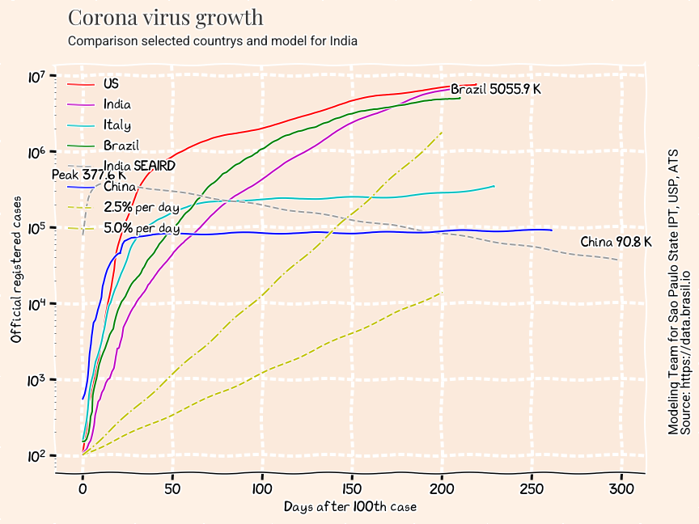
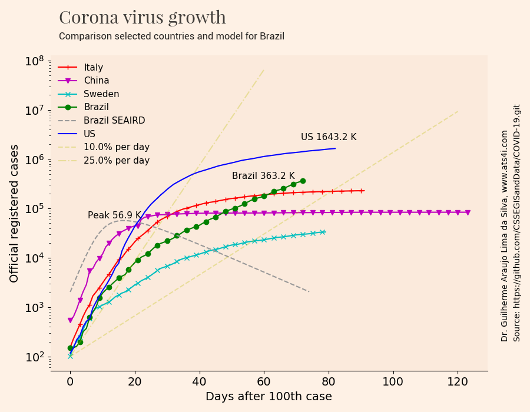
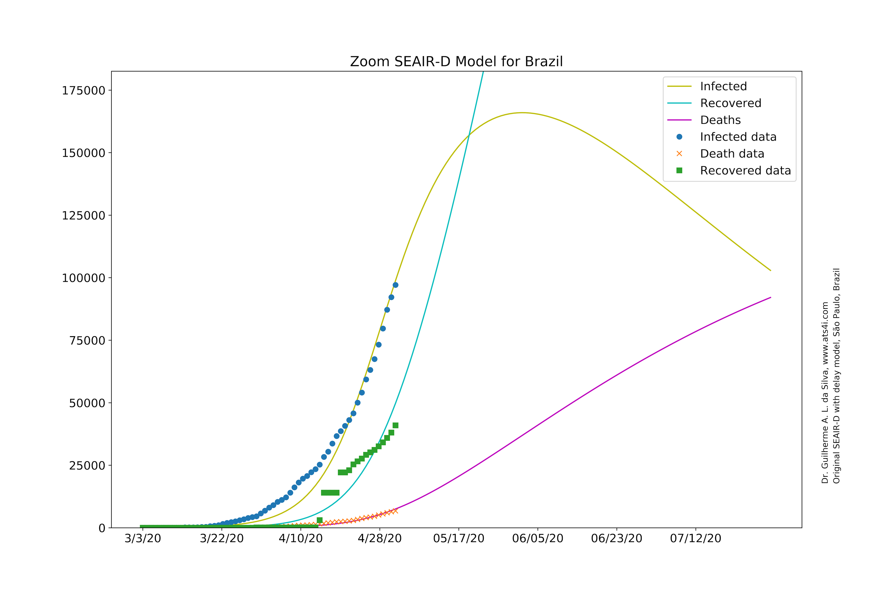

# dataAndModelsCovid19

The initial code for model SIR was based on the work published at gitHub https://github.com/Lewuathe/COVID19-SIR.
The author has a webpage of the project https://www.lewuathe.com/covid-19-dynamics-with-sir-model.html
All the copyrights for the parts of the code are due to Kai Sassaki https://github.com/Lewuathe. As needed, we are using Apache 2.0 license also.

The code was modified to include data analysis a new models SEAIR-D was developed, which is very new and original with time delays, deaths and other constants. A conversion to a Jupyter Notebook was made and three other codes were included: one for initial conditions optimization by evolutionary algorithm, other for ploting results in a map and last one to see the evolution of evolutionary calculation.

The project has three codes for Covid-19 infection in:
* countries at root
* Brazilian states at ```./statesBrazil```
* district regions of Sao Paulo State, Brazil at ```./regionsSP```

After some time, and sucess, the Institute of Technologies of Sao Paulo State (http://www.ipt.br) modified the code and used it to predict the demand for respirators and hospitals for Sao Paulo State, Brazil. The modified code, a Jupyter Notebook, can be accessed in subfolder ```./regionsSP```. It calculate infected, recovered and deaths for all administrative regions of Sao Paulo State. The final result can be seen at http://covid19.ats4i.com

It was also developed to predict Covid-19 infection for Brazilian States. You can see that at Jupyter Notebook at ```./statesBrazil```

If you have interest, ATS (www.ats4i.com) has some posts about Covid-19 pandemics modeling.

This is a open source contribution for the comunity. Please use and contribute!

## Installation

Clone this repository

```
git clone https://github.com/gasilva/dataAndModelsCovid19.git
```

Or use GitHub Desktop [https://desktop.github.com/](https://desktop.github.com/) and File, Clone repository

## Codes

The project has some codes for Covid-19 infection in countries:
* ```countries_Covid19_v7.ipynb```: main code
* ```initialConditions_YaboxNew_v6.ipynb```: code to find initial conditions for the main code
* ```historyIC.ipynb```: plot optimization history while code of initial conditions is run
* ```plotMaps.ipynb```: plot results in a map (under development)

The Brazlian States and Sao Paulo region follows the same logic.

## Countries and Initial Conditions

The countries and initial parameters file is `data/param.csv`

|country|start-date|range|s0  |e0  |a0  |i0 |r0 |d0 |START|WCASES|WREC|WDTH|
|-------|----------|----------------|----|----|----|---|---|---|-----|------|----|----
|Brazil |3/2/20    |200             |10e6|1e-4|1e-4|200|100|50 |50   |.15   |0.05|0.8 
|China  |1/28/20   |200             |50e3|1e-4|1e-4|200|100|50 |50   |.15   |0.05|0.8 
|Italy  |2/28/20   |200             |2e6 |1e-4|1e-4|200|100|50 |50   |.15   |0.05|0.8 
|US     |2/20/20   |200             |20e6|1e-4|1e-4|200|100|50 |50   |.15   |0.05|0.8 
|India  |3/10/20   |200             |10e6|1e-4|1e-4|200|100|50 |50   |.15   |0.05|0.8 


The optimized initial conditions are taken from the file `param_optimized_Yabox_HistMin.csv`

|country|start-date|range|s0  |e0  |a0  |i0 |r0 |d0 |START|WCASES|WREC|WDTH|
|-------|----------|----------------|----|----|----|---|---|---|-----|------|----|----|
|Brazil |03/03/20  |200             |32509903|0   |0   |71 |477|329|286  |0.4003|0.3898|0.1397|
|China  |01/29/20  |200             |674008260|0   |0   |200|100|50 |50   |0.3926|0.4784|0.4224|
|Italy  |02/29/20  |200             |525450|0   |0   |129|71 |157|302  |0.2731|0.2884|0.2461|
|US     |02/19/20  |200             |23452805|0   |0   |135|167|472|194  |0.7096|0.1996|0.3107|
|India  |03/10/20  |200             |37519697|0   |0   |265|362|81 |128  |0.9216|0.3379|0.4319|

The Brazlian States and Sao Paulo region follows the same logic.

## Databases Used in This Study
 
### Data

This code for countries has data from Repository by Johns Hopkins CSSE

https://github.com/CSSEGISandData/COVID-19

For Brazilian States and Sao Paulo State Regions the data is from Brazil.io

https://data.brasil.io/dataset/covid19/_meta/list.html

## Data Analysis

### Log Plot for Covid-19 Infection in 5 Countries




### Bar Plot for Covid-19 for Infected Cases


### Simple Exponential and Logistic Functions Fitting for Covid-19 Infected Data


## Theory

The mathematical Models are based in Lotka-Volterra equations, it is like a predator-prey type of model.


Source: [https://triplebyte.com/blog/modeling-infectious-diseases](https://triplebyte.com/blog/modeling-infectious-diseases)

A simple mathematical description of the spread of a disease in a population is the so-called SIR model, which divides the (fixed) population of N individuals into three "compartments" which may vary as a function of time, t:

- S(t) are those susceptible but not yet infected with the disease
- I(t) is the number of infectious individuals
- R(t) are those individuals who have recovered (dead+healed)

---

β : Effective contact rate [1/min]

γ: Recovery(+Mortality) rate [1/min]

---

The SIR model describes the change in the population of each of these compartments in terms of two parameters, β and γ. β describes the effective contact rate of the disease: an infected individual comes into contact with βN other individuals per unit time (of which the fraction that are susceptible to contracting the disease is S/N). γ is the mean recovery rate: that is, 1/γ is the mean period of time during which an infected individual can pass it on.

The differential equations describing this model were first derived by Kermack and McKendrick [Proc. R. Soc. A, 115, 772 (1927)]:

### SIR - Susceptible, Infected and Recovered Model


Here, the number of 'recovery' englobes both recovered and deaths. This parameter is represented by γ.

The SIR model code is based on

https://www.lewuathe.com/covid-19-dynamics-with-sir-model.html

https://github.com/Lewuathe/COVID19-SIR

https://www.kaggle.com/lisphilar/covid-19-data-with-sir-model

https://triplebyte.com/blog/modeling-infectious-diseases

The γ is split in two by γ = a + b, where a is the rate of recoveries, and b is the rate of death. Since the death rate seems to be linear (1.5% in China, for example), this linear decomposition of γ is precise enough. 

So we can add a new variable k, (Kill rate), and add to the system of equations. Therefore:

### SIR-D - SIR model extended to have deaths and recovered separated

- S(t) are those susceptible but not yet infected with the disease
- I(t) is the number of infectious individuals
- R(t) are those individuals who have healed
- K(t) are those individuals who have died

---

β : Effective contact rate [1/min]

γ: Recovery(+Mortality) rate γ=(a+b) [1/min]

a: recovery of healed  [1/min]

b: mortality rate  [1/min]

---


The last equation does not need to solved, because


The SIR-D model code is based on the contribution of Giuliano Belinassi, from IME-USP, Brazil

https://github.com/Lewuathe/COVID19-SIR/issues/13#issue-589616803

The the Python notebook of

https://www.kaggle.com/lisphilar/covid-19-data-with-sir-model#Scenario-in-Italy

### SEIR - WHO model type for susceptible, exposed, infected and recovered with delay in recoveries


Source: [https://triplebyte.com/blog/modeling-infectious-diseases](https://triplebyte.com/blog/modeling-infectious-diseases)

- S(t) are those susceptible but not yet infected with the disease
- E(t) are those exposed to the virus
- I(t) is the number of infectious individuals
- R(t) are those individuals who have recovered (deads+healed)

---

β : Effective contact rate [1/min]

γ: Recovery(+Mortality) rate γ=(a+b) [1/min]

σ: is the rate at which individuals move from the exposed to the infectious classes. Its reciprocal (1/σ) is the average latent (exposed) period.

σ2: is the rate at which individuals move from the infectious to the dead and healed classes. Its reciprocal (1/σ2) is the average latent (exposed) period.

---


The last equation does not need to solved, because


About SEIR models:

[https://idmod.org/docs/malaria/model-seir.html](https://idmod.org/docs/malaria/model-seir.html)

Codes from the book of Modeling Infectious Diseases in Humans and Animals
Matt J. Keeling & Pejman Rohani, Chaper 2.6, SEIR model

[http://homepages.warwick.ac.uk/~masfz/ModelingInfectiousDiseases/Chapter2/Program_2.6/index.html](http://homepages.warwick.ac.uk/~masfz/ModelingInfectiousDiseases/Chapter2/Program_2.6/index.html)

### SEIR-D - Original variation, proposed by this author, from SEIR model for susceptible, exposed, infected and deaths with delay in recoveries and deaths

- S(t) are those susceptible but not yet infected with the disease
- E(t) are those exposed to the virus
- I(t) is the number of infectious individuals
- R(t) are those individuals who have healed
- K(t) are those individuals who have died

---

β : Effective contact rate [1/min]

γ: Recovery(+Mortality) rate γ=(a+b) [1/min]

a: recovery of healed  [1/min]

b: mortality rate  [1/min]

σ: is the rate at which individuals move from the exposed to the infectious classes. Its reciprocal (1/σ) is the average latent (exposed) period.

σ2: is the rate at which individuals move from the infectious to the dead and healed classes. Its reciprocal (1/σ2) is the average latent period.

---

The splitting of deaths and healed from recoveries of the SEIR model is necessary because death data is more accurate than healed data of several countries.


The last equation does not need to solved, because


The model takes SEIR Model and split the r(t) and k(t) by making γ=a+b.


### SEAIR-D - Original variation, proposed by this author, from SEIR model for susceptible, exposed, asymptomatic, infected and deaths with delay in recoveries and deaths

- S(t) are those susceptible but not yet infected with the disease
- E(t) are those exposed to the virus
- A(t) is the number of cases asymptomatic
- I(t) is the number of infectious individuals
- R(t) are those individuals who have healed
- K(t) are those individuals who have died

---

β : Effective contact rate [1/min]

γ: Recovery(+Mortality) rate γ=(a+b) [1/min]

a: recovery of healed  [1/min]

b: mortality rate  [1/min]

σ: is the rate at which individuals move from the exposed to the infectious classes. Its reciprocal (1/σ) is the average latent (exposed) period.

σ2: is the rate at which individuals move from the infectious to the deadas and healed classes. Its reciprocal (1/σ2) is the average latent (exposed) period

p: is the fraction of the exposed which become symptomatic infectious sub-population.

(1-p): is the fraction of the exposed which becomes asymptomatic infectious sub-population.

---

The inclusion of asymptomatic cases in SEIRD model generates SEAIRD equation system:


The last equation does not need to solved, because


It is a new completely development model inspired on the paper below, because it does not have same equations and parameters:

[https://www.hindawi.com/journals/ddns/2017/4232971/#references](https://www.hindawi.com/journals/ddns/2017/4232971/#references)

Global optimization to fit real data


A zoom at infected, deaths and recovered



## Validation with Real Data from Selected Countries


## Models Comparison 

The comparison between model is presented below. All models were best fitted against real data. Everything can be updated and adjusted better than done here but it requires time. Brazil was selected to be compared however other countries also can be calculated and compared.


## References:

Anderson, R. M., May, R. M. , Infectious Diseases of Humans: Dynamics and Control, Oxford University Press, 1991

Cotta R.M., Naveira-Cotta, C. P., Magal, P., Modelling the COVID-19 epidemics in Brasil: Parametric identification and public health measures influence
medRxiv 2020.03.31.20049130; doi: https://doi.org/10.1101/2020.03.31.20049130

De la Sen, M., Ibeas, A., Alonso-Quesada, S.,Nistal, R., On a New Epidemic Model with Asymptomatic and Dead-Infective Subpopulations with Feedback Controls Useful for Ebola Disease, Discrete Dynamics in Nature and Society, Volume 2017, Article ID 4232971, 22 pages, Special Issue, Epidemic Processes on Complex Networks, https://doi.org/10.1155/2017/4232971

Glaser, A., Dynamics and Control of Infectious Diseases, Lecture, WWS556d, Princeton University, April 9, 2007. http://www.princeton.edu/~aglaser/lecture2007_diseases.pdf

Hamzaha, F.A.B.,Laub, C.H., Nazric, H., et al. CoronaTracker: World-wide COVID-19 Outbreak Data Analysis and Prediction CoronaTracker Community Research Group, [Submitted]. Bull World Health Organ. E-pub: 19 March 2020. doi: http://dx.doi.org/10.2471/BLT.20.255695

Keeling, M.J., Rohani, P., Modeling Infectious Diseases in Humans and Animals, Princeton University Press, Release Date: September 19, 2011, Princeton University Press, ISBN: 9781400841035 https://www.kobo.com/us/en/ebook/modeling-infectious-diseases-in-humans-and-animals Python, C++, Fortran, Matlab codes availables at: http://homepages.warwick.ac.uk/~masfz/ModelingInfectiousDiseases/index.html

Prem, K., Liu, Y, Russell, T.W. et al, The effect of control strategies to reduce social mixing on outcomes of the COVID-19 epidemic in Wuhan, China: a modelling study,The Lancet Public Health,2020,ISSN 2468-2667, https://doi.org/10.1016/S2468-2667(20)30073-6 and http://www.sciencedirect.com/science/article/pii/S2468266720300736

Trawicki, M. B., Deterministic Seirs Epidemic Model for Modeling Vital Dynamics, Vaccinations, and Temporary Immunity, Mathematics 2017, 5, 7;  https://doi.org/10.3390/math5010007 

William Ogilvy Kermack, A. G. McKendrick and Gilbert Thomas Walker 1997A contribution to the mathematical theory of epidemicsProc. R. Soc. Lond. A115700–721 https://doi.org/10.1098/rspa.1927.0118

