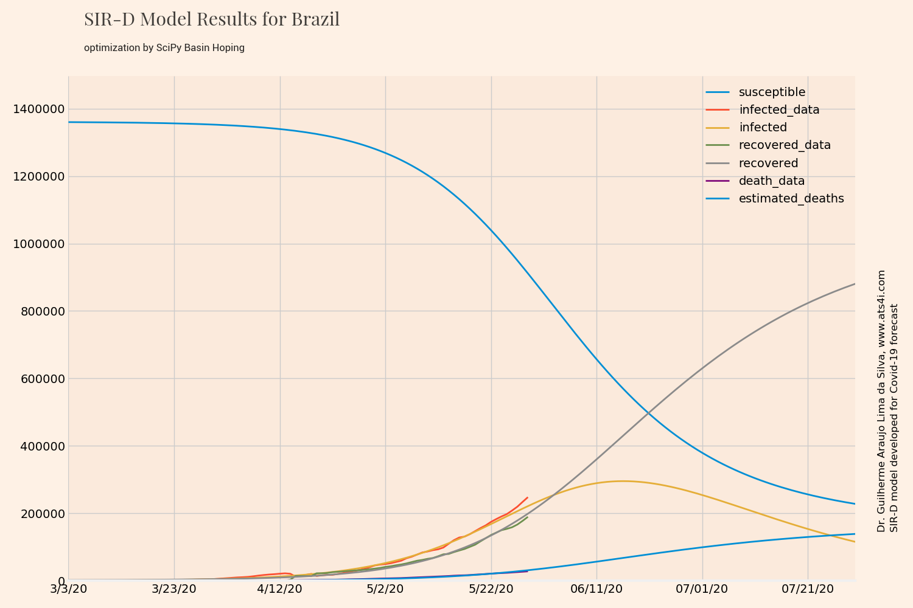

---

useMath = true

---


# dataAndModelsCovid19

## Installation

Clone this repository

```
git clone https://github.com/gasilva/dataAndModelsCovid19.git
```

Or use GitHub Desktop [https://desktop.github.com/](https://desktop.github.com/) and File, Clone repository

## Usage

Make changes directly in the dataAndModelsCovid19.py file.

Select one option 1 to 5 by variable opt

```
#Initial parameters
#Choose here your options

#option
#opt=0 all plots
#opt=1 corona log plot
#opt=2 logistic model prediction
#opt=3 bar plot with growth rate
#opt=4 log plot + bar plot
#opt=5 SIR-D Model
opt=0
```

Select countries to be plotted in log to analyze growth rate. All countries available.

```
#prepare data for plotting
country1="US"
[time1,cases1]=getCases(df,country1)
country2="Italy"
[time2,cases2]=getCases(df,country2)
country3="Brazil"
[time3,cases3]=getCases(df,country3)
country4="France"
[time4,cases4]=getCases(df,country4)
country5="Germany"
[time5,cases5]=getCases(df,country5)

```
Choose version to be place in the .png file name of log plot. This allows to you to analyze different set of countries.

```
#plot version - changes the file name png
version="2"
```


Select country to have the exponential and logistic function fitting. Choose one of the countries in the list above.

```
#choose country for curve fitting
#choose country for growth curve
#one of countries above
country="Brazil"

```

Choose country to analyze data by SIRD model. Some countries are already adjusted. Other countries may need extra work to adjust S_0, I_0, R_0 and K_0, i.e., the initial conditions. Plus it may required you to set the start date correctly. If a delay/lag exist in the recovery or dead data, it may be required to set negative values for R_0 and K_0. It may simulate the lag.

```
#choose country for SIRD model
# "Brazil"
# "China"
# "Italy"
# "France"
# "United Kingdom"
# "US"
# Countries above are already adjusted
countrySIRD="Brazil"
```

## Run Code

If you are using Visual Code Studio, select the folder you are running.

To run SEIAR-D model with Optimization of Sigma and Sigma2 with opt=5:

```python
python dataFit_SEAIR_sigmaOpt.py
```

Other solvers are located in sources directory. All rules presented here apply to those solvers.

## Command line use

This implementation comes from SIR model of [https://github.com/Lewuathe/COVID19-SIR](https://github.com/Lewuathe/COVID19-SIR)

It was added the K_0 value because SIRD model has initial deaths value in addition to S_0, I_0 and R_0.

You can analyze several countries by making a CSV list like: Brazil, Italy, US, France. Do not put spaces before or after commas.

```
 For other countries you can run at command line
 but be sure to define S_0, I_0, R_0, K_0
 the success of fitting will depend on these parameters

 usage: dataAndModelsCovid19.py [-h] [--countries COUNTRY_CSV] [--download-data]
                  [--start-date START_DATE] [--prediction-days PREDICT_RANGE]
                  [--S_0 S_0] [--I_0 I_0] [--R_0 R_0]

 optional arguments:
   -h, --help            show this help message and exit
   --countries COUNTRY_CSV
                         Countries on CSV format. It must exact match the data
                         names or you will get out of bonds error.
   --download-data       Download fresh data and then run
   --start-date START_DATE
                         Start date on MM/DD/YY format ... I know ...It
                         defaults to first data available 1/22/20
   --prediction-days PREDICT_RANGE
                         Days to predict with the model. Defaults to 150
   --S_0 S_0             S_0. Defaults to 100000
   --I_0 I_0             I_0. Defaults to 2
   --R_0 R_0             R_0. Defaults to 0
```

In SEIR and SEIR-D models, you have additionally

```
   --E_0 E_0             E_0. Defaults to 0
```

In SEAIR-D models, you have additionally

```
   --A_0 A_0             A_0. Defaults to 0
```

## Databases Used in This Study
 
### Data

This code has data from Repository by Johns Hopkins CSSE

https://github.com/CSSEGISandData/COVID-19

### Data Analysis

The log-curve of exponential growth in several countries is based on

https://www.ft.com/content/ae83040c-18e6-440e-bd00-e4c5cefdda26

The growth rate is original from Guilherme A. L. da Silva - http://www.at4i.com

### Curve Fitting

The exponential and logistic curves fitting is based on

https://towardsdatascience.com/covid-19-infection-in-italy-mathematical-models-and-predictions-7784b4d7dd8d

## Theory

### Mathematical Models

The mathematical Models are based in Lotka-Volterra equations, it is like a predator-prey type of model.


Source: [https://triplebyte.com/blog/modeling-infectious-diseases](https://triplebyte.com/blog/modeling-infectious-diseases)

A simple mathematical description of the spread of a disease in a population is the so-called SIR model, which divides the (fixed) population of N individuals into three "compartments" which may vary as a function of time, t:

- S(t) are those susceptible but not yet infected with the disease
- I(t) is the number of infectious individuals
- R(t) are those individuals who have recovered (dead+healed)

---

β : Effective contact rate [1/min]

γ: Recovery(+Mortality) rate [1/min]

---

The SIR model describes the change in the population of each of these compartments in terms of two parameters, β and γ. β describes the effective contact rate of the disease: an infected individual comes into contact with βN other individuals per unit time (of which the fraction that are susceptible to contracting the disease is S/N). γ is the mean recovery rate: that is, 1/γ is the mean period of time during which an infected individual can pass it on.

The differential equations describing this model were first derived by Kermack and McKendrick [Proc. R. Soc. A, 115, 772 (1927)]:

#### SIR - Susceptible, Infected and Recovered Model


Here, the number of 'recovery' englobes both recovered and deaths. This parameter is represented by γ.

The SIR model code is based on

https://www.lewuathe.com/covid-19-dynamics-with-sir-model.html

https://github.com/Lewuathe/COVID19-SIR

https://www.kaggle.com/lisphilar/covid-19-data-with-sir-model

https://triplebyte.com/blog/modeling-infectious-diseases

The γ is split in two by γ = a + b, where a is the rate of recoveries, and b is the rate of death. Since the death rate seems to be linear (1.5% in China, for example), this linear decomposition of γ is precise enough. 

So we can add a new variable k, (Kill rate), and add to the system of equations. Therefore:

#### SIR-D - SIR model extended to have deaths and recovered separated

- S(t) are those susceptible but not yet infected with the disease
- I(t) is the number of infectious individuals
- R(t) are those individuals who have healed
- K(t) are those individuals who have died

---

β : Effective contact rate [1/min]

γ: Recovery(+Mortality) rate γ=(a+b) [1/min]

a: recovery of healed  [1/min]

b: mortality rate  [1/min]

---





The SIR-D model code is based on the contribution of Giuliano Belinassi, from IME-USP, Brazil

https://github.com/Lewuathe/COVID19-SIR/issues/13#issue-589616803

The the Python notebook of

https://www.kaggle.com/lisphilar/covid-19-data-with-sir-model#Scenario-in-Italy

#### SEIR - WHO model type for susceptible, exposed, infected and recovered with delay in recoveries


Source: [https://triplebyte.com/blog/modeling-infectious-diseases](https://triplebyte.com/blog/modeling-infectious-diseases)

- S(t) are those susceptible but not yet infected with the disease
- E(t) are those exposed to the virus
- I(t) is the number of infectious individuals
- R(t) are those individuals who have recovered (deads+healed)

---

β : Effective contact rate [1/min]

γ: Recovery(+Mortality) rate γ=(a+b) [1/min]

σ: is the rate at which individuals move from the exposed to the infectious classes. Its reciprocal (1/σ) is the average latent (exposed) period.

σ2: is the rate at which individuals move from the infectious to the dead and healed classes. Its reciprocal (1/σ2) is the average latent (exposed) period.

---


The last equation does not need to solved, because


$$$
s(t)+e(t)+i(t)+r(t) \geq 1
$$$


About SEIR models:

[https://idmod.org/docs/malaria/model-seir.html](https://idmod.org/docs/malaria/model-seir.html)

Codes from the book of Modeling Infectious Diseases in Humans and Animals
Matt J. Keeling & Pejman Rohani, Chaper 2.6, SEIR model

[http://homepages.warwick.ac.uk/~masfz/ModelingInfectiousDiseases/Chapter2/Program_2.6/index.html](http://homepages.warwick.ac.uk/~masfz/ModelingInfectiousDiseases/Chapter2/Program_2.6/index.html)

#### SEIR-D - Original variation, proposed by this author, from SEIR model for susceptible, exposed, infected and deaths with delay in recoveries and deaths

- S(t) are those susceptible but not yet infected with the disease
- E(t) are those exposed to the virus
- I(t) is the number of infectious individuals
- R(t) are those individuals who have healed
- K(t) are those individuals who have died

---

β : Effective contact rate [1/min]

γ: Recovery(+Mortality) rate γ=(a+b) [1/min]

a: recovery of healed  [1/min]

b: mortality rate  [1/min]

σ: is the rate at which individuals move from the exposed to the infectious classes. Its reciprocal (1/σ) is the average latent (exposed) period.

σ2: is the rate at which individuals move from the infectious to the dead and healed classes. Its reciprocal (1/σ2) is the average latent period.

---

The splitting of deaths and healed from recoveries of the SEIR model is necessary because death data is more accurate than healed data of several countries.


The last equation does not need to solved, because


The model takes SEIR Model and split the r(t) and k(t) by making γ=a+b.


#### SEAIR-D - Original variation, proposed by this author, from SEIR model for susceptible, exposed, asymptomatic, infected and deaths with delay in recoveries and deaths

- S(t) are those susceptible but not yet infected with the disease
- E(t) are those exposed to the virus
- A(t) is the number of cases asymptomatic
- I(t) is the number of infectious individuals
- R(t) are those individuals who have healed
- K(t) are those individuals who have died

---

β : Effective contact rate [1/min]

γ: Recovery(+Mortality) rate γ=(a+b) [1/min]

a: recovery of healed  [1/min]

b: mortality rate  [1/min]

σ: is the rate at which individuals move from the exposed to the infectious classes. Its reciprocal (1/σ) is the average latent (exposed) period.

$\sigma_2$: is the rate at which individuals move from the infectious to the deadas and healed classes. Its reciprocal (1/$\sigma_2$) is the average latent (exposed) period

p: is the fraction of the exposed which become symptomatic infectious sub-population.

(1-p): is the fraction of the exposed which becomes asymptomatic infectious sub-population.

---

The inclusion of asymptomatic cases in SEIRD model generates SEAIRD equation system:


The last equation does not need to solved, because


It is a new completely development model inspired on the paper below, because it does not have same equations and parameters:

[https://www.hindawi.com/journals/ddns/2017/4232971/#references](https://www.hindawi.com/journals/ddns/2017/4232971/#references)


### Models Comparison 

The comparison between model is presented below. All models were best fitted against real data. Everything can be updated and adjusted better than done here but it requires time. Brazil was selected to be compared however other countries also can be calculated and compared.


### References:

Anderson, R. M., May, R. M. , Infectious Diseases of Humans: Dynamics and Control, Oxford University Press, 1991

Cotta R.M., Naveira-Cotta, C. P., Magal, P., Modelling the COVID-19 epidemics in Brasil: Parametric identification and public health measures influence
medRxiv 2020.03.31.20049130; doi: https://doi.org/10.1101/2020.03.31.20049130

De la Sen, M., Ibeas, A., Alonso-Quesada, S.,Nistal, R., On a New Epidemic Model with Asymptomatic and Dead-Infective Subpopulations with Feedback Controls Useful for Ebola Disease, Discrete Dynamics in Nature and Society, Volume 2017, Article ID 4232971, 22 pages, Special Issue, Epidemic Processes on Complex Networks, https://doi.org/10.1155/2017/4232971

Glaser, A., Dynamics and Control of Infectious Diseases, Lecture, WWS556d, Princeton University, April 9, 2007. http://www.princeton.edu/~aglaser/lecture2007_diseases.pdf

Hamzaha, F.A.B.,Laub, C.H., Nazric, H., et al. CoronaTracker: World-wide COVID-19 Outbreak Data Analysis and Prediction CoronaTracker Community Research Group, [Submitted]. Bull World Health Organ. E-pub: 19 March 2020. doi: http://dx.doi.org/10.2471/BLT.20.255695

Keeling, M.J., Rohani, P., Modeling Infectious Diseases in Humans and Animals, Princeton University Press, Release Date: September 19, 2011, Princeton University Press, ISBN: 9781400841035 https://www.kobo.com/us/en/ebook/modeling-infectious-diseases-in-humans-and-animals Python, C++, Fortran, Matlab codes availables at: http://homepages.warwick.ac.uk/~masfz/ModelingInfectiousDiseases/index.html

Prem, K., Liu, Y, Russell, T.W. et al, The effect of control strategies to reduce social mixing on outcomes of the COVID-19 epidemic in Wuhan, China: a modelling study,The Lancet Public Health,2020,ISSN 2468-2667, https://doi.org/10.1016/S2468-2667(20)30073-6 and http://www.sciencedirect.com/science/article/pii/S2468266720300736

Trawicki, M. B., Deterministic Seirs Epidemic Model for Modeling Vital Dynamics, Vaccinations, and Temporary Immunity, Mathematics 2017, 5, 7;  https://doi.org/10.3390/math5010007 

William Ogilvy Kermack, A. G. McKendrick and Gilbert Thomas Walker 1997A contribution to the mathematical theory of epidemicsProc. R. Soc. Lond. A115700–721 https://doi.org/10.1098/rspa.1927.0118

